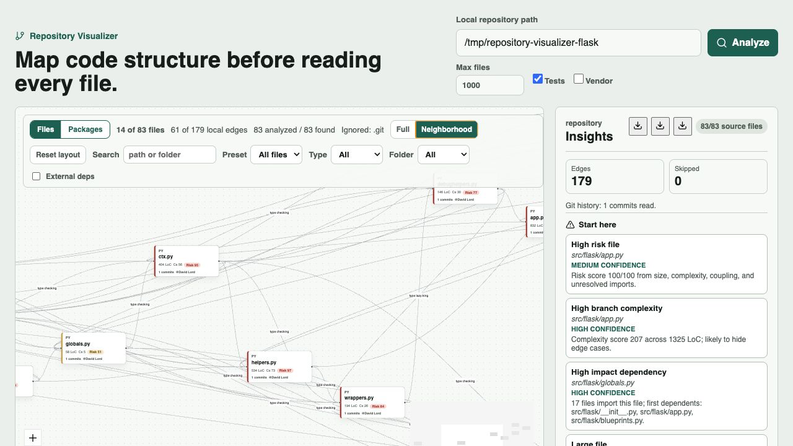

# Repository Visualizer

Repository Visualizer is a local-first codebase understanding tool. Point it at a local repository and it statically builds a dependency graph, ranks the files worth reading first, shows selected-file blast radius, and can summarize files with OpenAI.

It is built for onboarding and refactoring. Instead of dumping a giant graph and calling it insight, it answers the questions that matter first:

- Where should I start reading?
- Which files are risky, bloated, highly coupled, or changed most often?
- What imports what, and is that dependency top-level, lazy, conditional, type-checking, re-exported, or dynamic?
- Which package/folder owns most of the risk, and who is its primary author?
- What could break if I change this file?
- Which file-level functions/classes deserve attention before a refactor?



## Features

- **Local scanning** through a FastAPI backend. Target code is read, not executed.
- **Dependency extraction** for Python, JavaScript/TypeScript, TypeScript path aliases, dynamic imports, re-exports, type-checking imports, lazy/local imports, and C/C++ includes.
- **Scoped edge labels** so dependencies are not all treated equally. Top-level imports, lazy/local imports, conditional imports, type-checking imports, re-exports, and dynamic imports are labeled separately.
- **Repository insights** with ranked "Start here" findings, confidence labels, risk hotspots, likely entry points, reading order, packages by risk, folder summaries, cycles, large files, possibly-unused files, unresolved imports, and dependency hubs.
- **Git intelligence** (when the scan root is inside a Git repository): per-file churn, bug-fix-commit count, recency, primary owner with ownership share, and package-level bus factor, read from recent history. It degrades cleanly to static-only metrics outside a repo, with no fabricated values.
- **Risk scoring** for files and packages from size, complexity, coupling, unresolved imports, static security hints, and — when available — Git churn and bug-fix frequency.
- **Package graph view** that compresses the repo into risk-ranked packages with ownership, bus factor, and weighted cross-package edges; click a package to drill into its files.
- **Symbol hotspots** for functions/classes inside Python and JavaScript/TypeScript files, capped to the symbols most likely to matter.
- **Static security and framework hints** for obvious secret-like values, unsafe APIs, FastAPI/Flask/Django surfaces, React roots, and Node-style route files.
- **Large-repo controls** with file caps, truncation warnings, graph search, extension/folder filters, hide-tests, connected-only, hubs, issues, and neighborhood mode.
- **Selected-file impact** showing direct dependencies, direct dependents, second-order dependents, likely affected tests, and Git history.
- **React Flow canvas** with file and package views, an external-dependency layer toggle, draggable nodes, zoom/pan, minimap, saved node positions, and reset layout.
- **OpenAI summaries** cached locally by file content and prompt version. Without `OPENAI_API_KEY`, the graph still works and the UI shows AI disabled.
- **Markdown, CSV, and JSON exports** for onboarding notes, PR planning, spreadsheet review, or sharing a scan snapshot.

## Tech Stack

- Backend: Python, FastAPI, Pydantic, Uvicorn, httpx, SQLite cache.
- Frontend: React, TypeScript, Vite, React Flow, Dagre, Lucide icons.
- Tests: Pytest, Vitest, TypeScript build.
- Runtime: local backend plus local browser UI. No database server required.

## How It Works

1. The backend scans supported source files under a local path.
2. Static parsers extract imports/includes, dependency scope, symbols, and lightweight hints.
3. The analyzer resolves local edges and calculates LoC, size, branch complexity, maintainability, risk score, dependency count, and dependent count.
4. The report builder ranks files, packages, cycles, hubs, entry points, and likely reading order.
5. The frontend renders the graph, filters, selected-file impact, package insights, exports, and optional summary panel.

## Requirements

- Python 3.11 or newer. The project is tested with Python 3.13.
- Node.js 22 or newer.
- npm.
- Optional: Docker and Docker Compose.
- Optional: `OPENAI_API_KEY` for file summaries.

Run the backend only on a machine you trust. It reads local paths by design and is not hardened for public hosting.

## Run Locally

Start the backend:

```bash
cd backend
python3 -m venv .venv
source .venv/bin/activate
pip install -e ".[dev]"
uvicorn app.main:app --reload
```

Start the frontend in another terminal:

```bash
cd frontend
npm install
npm run dev
```

Open `http://127.0.0.1:5173`, enter a local repository path, and click **Analyze**.

For a quick built-in scan, use:

```text
backend/tests/fixtures/sample_repo
```

Set `VITE_API_BASE` only if the backend is not running at `http://127.0.0.1:8000`.

## Optional OpenAI Summaries

```bash
export OPENAI_API_KEY=...
```

Then select a file node and click **Generate summary** or **Refresh summary**. Summaries are cached in SQLite by file content, model, provider, and prompt version.

## Docker

```bash
docker compose up --build
```

Open `http://127.0.0.1:5173`.

Inside Docker, this repo is mounted read-only at:

```text
/workspace/repository-visualizer
```

Use that path for a demo scan, or add another bind mount in `docker-compose.yml` for a different local repository.

## Test And Build

```bash
cd backend && pytest
cd frontend && npm test
cd frontend && npm run build
```

CI runs backend tests, frontend tests, and frontend build on pull requests.

## API

- `GET /api/health` checks backend health.
- `POST /api/analyze` scans a local path and returns graph JSON.
- `POST /api/summarize` summarizes a selected file with OpenAI or returns cached/disabled state.

Minimal analyze request:

```json
{
  "root_path": "/absolute/path/to/repo",
  "max_files": 1000,
  "include_tests": true,
  "include_vendor": false
}
```

The analyze response includes `nodes`, scoped `edges`, `folder_summaries`, `package_summaries`, `package_edges`, `cycles`, `repo_report`, a `git` summary, and scan `stats` such as `total_files_found`, `analyzed_files`, `skipped_files`, `truncated`, and `warnings`.

Each file node includes:

- file metrics: LoC, total lines, size, complexity, maintainability, risk score, dependency count, dependent count
- local imports and imported-by relationships
- unresolved and external imports
- top symbol hotspots
- static security/framework hints
- Git history (when available): commits, churn, bug-fix commits, primary owner, and recency

## Large Repository Behavior

The analyzer defaults to the first 1000 eligible source files. That is deliberate: a 3000-file repository rendered as one graph is usually unreadable.

Use these controls for large repos:

- Raise or lower **Max files** before analysis.
- Turn off **Tests** if test-heavy repos drown out core source.
- Use graph presets: **Hide tests**, **Connected only**, **Hubs**, and **Issues**.
- Use **Neighborhood** mode after selecting a risky file.
- Export Markdown, CSV, or JSON when you need a compact review artifact.

Dogfood results:

| Size | Repository | Files analyzed | Edges | Time |
| --- | --- | ---: | ---: | ---: |
| Small | `pallets/markupsafe` | 13 / 13 | 11 | ~13 ms |
| Medium | `pallets/flask` | 83 / 83 | 176 | ~140 ms |
| Large | `django/django` | 1000 / 2969 | 3695 | ~1.7 s |

See [docs/dogfood.md](docs/dogfood.md) for what the dogfood pass found and changed.


