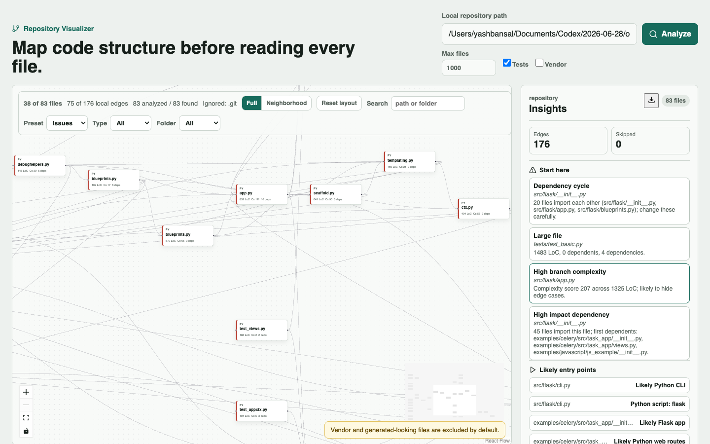

# Repository Visualizer

Repository Visualizer is a local-first codebase understanding tool. It scans a local repository, builds an interactive dependency graph, ranks files worth reading first, shows change impact for selected files, and optionally uses OpenAI to summarize source files.

It is built for onboarding and refactoring, not for hosted repository management. The goal is simple: point a developer at a large unfamiliar repo and answer:

- Where should I start reading?
- Which files are risky or bloated?
- What imports what?
- What could break if I change this file?
- Which source files look like entry points?



## Features

- **Local repository scanning** with FastAPI. The target code is read statically and is not executed.
- **Dependency extraction** for Python imports, JavaScript/TypeScript imports, dynamic imports, TypeScript path aliases, and C/C++ includes.
- **Repository insights** with ranked Start here findings, confidence labels, likely entry points, reading order, folder summaries, cycles, large files, complexity hotspots, unresolved imports, and dependency hubs.
- **Large-repo controls** with source-file caps, truncation warnings, graph search, extension/folder filters, issue/hub presets, hide-tests preset, connected-only preset, and neighborhood mode.
- **Selected-file blast radius** showing local dependencies, direct dependents, second-order dependents, and likely affected tests.
- **React Flow graph canvas** with draggable nodes, zoom/pan, minimap, saved node positions, and reset layout.
- **OpenAI-only file summaries** cached locally by file content and prompt version. If no `OPENAI_API_KEY` is set, the graph still works and the UI shows AI disabled.
- **Markdown report export** for onboarding notes, PR planning, or sharing a snapshot outside the app.
- **Dogfood evidence** from `markupsafe`, `flask`, and `django` in [`docs/dogfood`](docs/dogfood).

## Tech Stack

- Backend: Python, FastAPI, Pydantic, Uvicorn, httpx, SQLite cache.
- Frontend: React, TypeScript, Vite, React Flow, Dagre, Lucide icons.
- Testing: Pytest, Vitest, TypeScript build.
- Runtime model: local backend + local browser UI. No database server required.

## How It Works

1. The backend scans supported source files under a local path.
2. Static parsers extract imports/includes and resolve local edges.
3. The analyzer calculates file metrics such as LoC, size, branch complexity, dependency count, and dependent count.
4. The backend returns graph data plus a `repo_report` containing prioritized findings and likely entry points.
5. The frontend renders the graph, report, filters, selected-file impact, and optional OpenAI summary panel.

## Requirements

- Python 3.11 or newer. The project is tested with Python 3.13.
- Node.js 22 or newer.
- npm.
- Optional: Docker and Docker Compose.
- Optional: `OPENAI_API_KEY` for AI summaries.

The target repository must be readable from the machine running the backend.

## Run Locally

Start the backend:

```bash
cd backend
python3 -m venv .venv
source .venv/bin/activate
pip install -e ".[dev]"
uvicorn app.main:app --reload
```

Start the frontend in another terminal:

```bash
cd frontend
npm install
npm run dev
```

Open:

```text
http://127.0.0.1:5173
```

Enter a local repository path and click **Analyze**.

For a quick built-in scan, use:

```text
backend/tests/fixtures/sample_repo
```

## Optional OpenAI Summaries

The analyzer and graph do not require AI. To enable file summaries:

```bash
export OPENAI_API_KEY=...
```

Then select a file node and click **Generate summary** or **Refresh summary**.

Summaries are cached in a local SQLite database, keyed by file content, model, provider, and prompt version. A file is re-analyzed only when its cache key changes.

## Run With Docker

```bash
docker compose up --build
```

Then open:

```text
http://127.0.0.1:5173
```

Inside Docker, this project is mounted read-only at:

```text
/workspace/repository-visualizer
```

Use that path for a demo scan, or add another bind mount to `docker-compose.yml` for a different local repository.

## Test And Build

Backend tests:

```bash
cd backend
pytest
```

Frontend tests:

```bash
cd frontend
npm test
```

Frontend production build:

```bash
cd frontend
npm run build
```

CI runs backend tests, frontend tests, and frontend build on pull requests.

## API

The backend exposes three endpoints:

- `GET /api/health` checks backend health.
- `POST /api/analyze` scans a local path and returns graph JSON.
- `POST /api/summarize` summarizes a selected file with OpenAI or returns cached/disabled state.

Minimal analyze request:

```json
{
  "root_path": "/absolute/path/to/repo",
  "max_files": 1000,
  "include_tests": true,
  "include_vendor": false
}
```

The response includes:

- `nodes` and `edges` for React Flow.
- `folder_summaries`.
- `cycles`.
- `repo_report.start_here`.
- `repo_report.entry_points`.
- `repo_report.reading_order`.
- `stats.total_files_found`, `stats.analyzed_files`, `stats.skipped_files`, `stats.truncated`, and `stats.warnings`.

## Large Repository Behavior

The analyzer defaults to the first 1000 eligible source files. This is deliberate: a 3000-file repo rendered as one graph is usually unreadable.

Use these controls for large repos:

- Raise or lower **Max files** before analysis.
- Turn off **Tests** if test-heavy repos drown out core source.
- Use graph presets: **Hide tests**, **Connected only**, **Hubs**, and **Issues**.
- Use **Neighborhood** mode after selecting a risky file.
- Export the Markdown report when you need a compact review artifact.

Dogfood results:

| Repository | Size | Files analyzed | Edges | Time |
| --- | --- | ---: | ---: | ---: |
| `pallets/markupsafe` | small | 13 / 13 | 11 | 12.9 ms |
| `pallets/flask` | medium | 83 / 83 | 176 | 139.4 ms |
| `django/django` | large | 1000 / 2969 | 3695 | 1697.0 ms |

See [`docs/dogfood/three-repo-2026-06-30.md`](docs/dogfood/three-repo-2026-06-30.md) for the comparison and fixes made from it.

## Assumptions

- Static dependency parsing is enough for first-pass orientation.
- The app should remain local-first and simple to run.
- Supported source files matter more than every repository asset. The UI labels counts as `analyzed / found source files` for that reason.
- Package `__init__.py` files may be public API facades, so they are not automatically treated as bad coupling.
- Truncated scans are partial rankings, not full repository truth.
- OpenAI is optional. The core tool must remain useful without an API key.

## Known Limitations

- Dependency parsing is static and cannot fully classify top-level, lazy, conditional, type-checking, and re-export edges yet.
- Dynamic framework behavior is only partially visible. Django settings imports, Flask app factories, plugin loading, templates, routes, signals, and database backends may not appear as graph edges.
- External dependencies are stored as metadata, not rendered as nodes.
- `.gitignore` support covers common root patterns and directory ignores, not every advanced Git ignore case.
- Very large repos still need deeper backend-backed subgraph loading or streamed output.
- Method/class hotspot ranking inside large files is future work.

## Useful Next Features

- Edge timing labels: top-level, lazy/local, conditional, type-checking, re-export.
- Method/class hotspot ranking for giant files like ORM query builders.
- Package-level compressed summaries before raw graph rendering.
- AST/import extraction cache by file hash.
- Optional CSV/JSON export in addition to Markdown.
- Framework-aware layers for routes, templates, signals, settings, and app registries.
