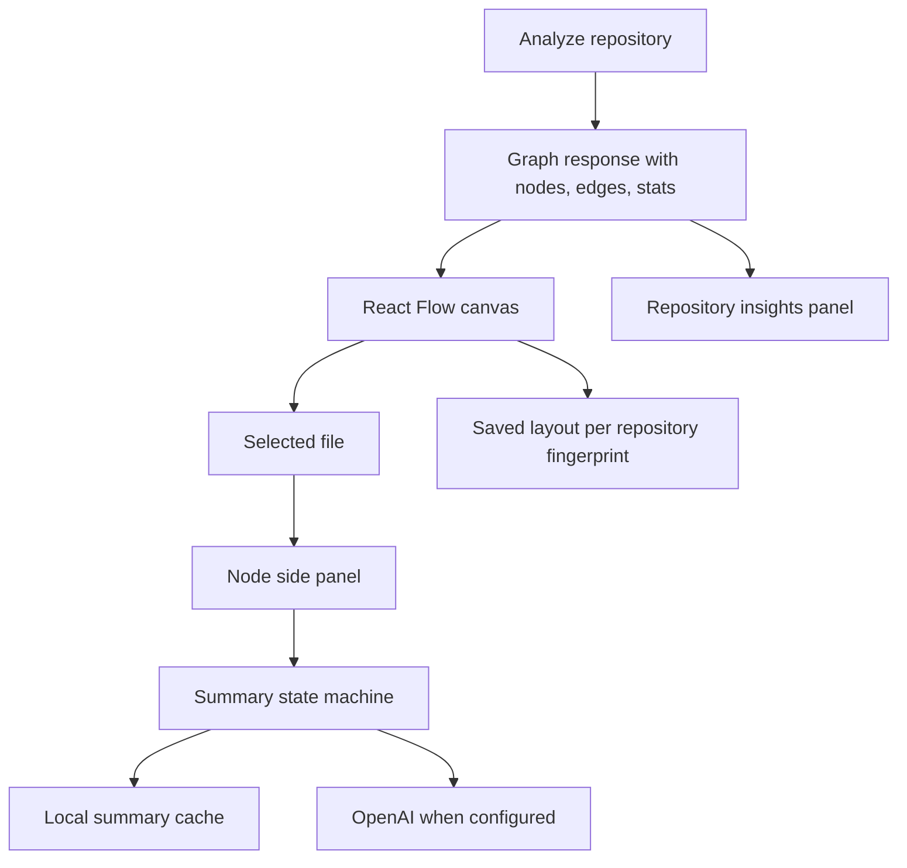

# feat: Complete Repository Visualizer Product

## Completion Notes

Completed on 2026-06-29 across six focused commits. The app now has selection-driven cached summary state, repository insights, full/neighborhood graph modes, persisted graph layouts, hardened scan/dependency handling, CI, Docker packaging, and updated demo documentation.

## Summary

This plan turns the current working MVP into a stronger project by closing the strict brief gap around click-triggered AI summaries, adding architecture insight views, saving user graph organization, hardening dependency parsing, and making the app easier to run and demo. It keeps the product local-first and avoids background-job architecture unless synchronous limits stop being enough.

---

## Baseline Deliverable Coverage

This table captured the state when the plan was written. The completion notes above summarize what shipped.

| Brief item | Baseline status | Gap |
|---|---:|---|
| Traverse a local directory | Done | Needs `.gitignore`-aware polish later |
| Parse dependencies and lines of code | Done | Parser accuracy can improve for Python packages and TypeScript aliases |
| REST endpoint returning nodes and edges | Done | Metadata already added |
| React project with React Flow canvas | Done | Needs saved layouts and better large-graph navigation |
| Click node and summarize code with AI | Partial | Node click selects; summary still needs a button click |
| Display summaries in side panel | Done | Needs automatic cached/disabled state on node selection |
| Cache AI summaries until content changes | Done | Needs visible cache metadata and privacy/cost UX |
| Show LoC/complexity metrics | Done | Needs dashboard-level “what should I inspect first?” views |

---

## Problem Frame

The app already demonstrates the original three deliverables, but it still feels like an MVP because the user must manually ask for AI after selecting a node, the graph has no saved layout, and the main view does not surface the most important files without manual scanning. The next work should make the tool feel finished in demos: select a file, get context, see hotspots, organize the map, and rerun the app cleanly on another machine.

---

## Requirements

**Brief completion**

- R1. Selecting a node should trigger the summary workflow in the side panel without requiring a second “Explain file” action for cached or disabled summary states.
- R2. AI requests must stay local-first and cost-aware, with clear OpenAI configuration, disabled state, cache state, and no surprise paid request when keys are absent.
- R3. The existing file-summary cache must remain content-hash based so edited files are re-analyzed and unchanged files reuse cached summaries.

**Product quality**

- R4. The UI should surface repository-level insights such as largest files, highest complexity, dependency hubs, and unresolved imports.
- R5. Users should be able to save and restore graph node positions for a repository so manual organization survives reloads.
- R6. Large-repo navigation should support focused exploration through folder grouping or selected-node neighborhood views.
- R7. Dependency parsing should handle common real-project layouts better without running target code.
- R8. The project should be easy to run, test, and present from a fresh clone.

---

## High-Level Technical Design

The product should keep the current simple request/response analysis path. The improvement is a richer client experience around the graph and a more deliberate AI-summary state machine, not a new distributed architecture.

---

## Key Technical Decisions

- **Auto-summary should be state-aware, not always paid:** On node selection, the panel should check summary state and show cached, disabled, loading, or error states. If `OPENAI_API_KEY` is absent, the user gets immediate disabled guidance; if a cache hit exists, it appears without cost.
- **Use local browser storage for saved layouts first:** Persisting layout in backend storage would add repo identity and lifecycle questions. Local storage is enough for a local-first desktop demo and keeps the implementation small.
- **Add insight panels before background jobs:** A dashboard of hotspots and unresolved imports is more useful for onboarding than a job queue right now. Background jobs remain deferred unless scans become too slow under realistic caps.
- **Improve parsers around common conventions, not full language semantics:** Python package roots, TypeScript path aliases, and `.gitignore` awareness give practical wins. Full AST support can wait.
- **Package for repeatable local demo:** Docker/dev scripts/CI make the project look maintained and reduce setup friction for reviewers.

---

## Implementation Units

### U1. Make Node Selection Trigger Summary State

- **Goal:** Make selecting a graph node populate the side panel’s AI summary state automatically while preserving OpenAI cache behavior.
- **Requirements:** R1, R2, R3
- **Dependencies:** None
- **Files:** `frontend/src/App.tsx`, `frontend/src/components/NodePanel.tsx`, `frontend/src/api/client.ts`, `frontend/src/types/graph.ts`, `frontend/tests/node-panel.test.tsx`, `backend/app/ai.py`, `backend/tests/test_api.py`, `backend/tests/test_cache.py`
- **Approach:** Move summary lifecycle from a purely button-driven action into a node-driven effect. Keep the manual button as “refresh summary” when useful, but default node selection should immediately show cached/disabled/loading/error state. The backend can continue using `/api/summarize`; add small response fields only if the UI needs clearer cache status.
- **Patterns to follow:** Existing `SummaryService`, `SummaryCache`, and `NodePanel`.
- **Test scenarios:** Selecting a node with no API key shows disabled OpenAI guidance; selecting a cached file shows cached text without requiring another click; changing selected nodes clears stale summary text; OpenAI errors render inside the panel.
- **Verification:** Frontend tests prove selection-driven state; backend tests prove cache hits still depend on content hash and model.

### U2. Add Repository Insights Dashboard

- **Goal:** Show the user where to start reading: hotspots, hubs, unresolved imports, and scan stats.
- **Requirements:** R4
- **Dependencies:** None
- **Files:** `frontend/src/App.tsx`, `frontend/src/components/RepositoryInsights.tsx`, `frontend/src/types/graph.ts`, `frontend/src/styles.css`, `frontend/tests/repository-insights.test.tsx`
- **Approach:** Derive insights client-side from the graph response: largest LoC, highest complexity, most imported files, files with most dependencies, unresolved relative imports, and scan warnings. Clicking an insight should select the corresponding node and keep the graph panel in sync.
- **Patterns to follow:** Existing component-local state and metric display in `NodePanel`.
- **Test scenarios:** Graph with known metrics ranks hotspots correctly; unresolved imports appear with file paths; clicking a hotspot calls the node selection handler; empty graphs render a quiet empty state.
- **Verification:** The UI gives a reviewer an obvious “start here” workflow after analysis.

### U3. Add Focused Graph Exploration

- **Goal:** Let users narrow large graphs by relationship, not only by text search.
- **Requirements:** R6
- **Dependencies:** U2
- **Files:** `frontend/src/graph/GraphCanvas.tsx`, `frontend/src/graph/layout.ts`, `frontend/src/App.tsx`, `frontend/src/styles.css`, `frontend/tests/graph-view.test.tsx`
- **Approach:** Add a neighborhood mode that shows the selected node, direct imports, and direct dependents. Keep the existing full graph and text/extension filters. A later folder-grouping view can build on the same filtered graph pipeline if time permits.
- **Patterns to follow:** Existing `visibleGraph` filtering and selected-node sync logic.
- **Test scenarios:** Neighborhood mode shows only the selected node plus one-hop relations; mode changes preserve a valid selected node; search and extension filters still remove dangling edges; empty neighborhoods show the selected node.
- **Verification:** Django-scale graph can be narrowed to a readable local dependency view.

### U4. Save and Restore Graph Layouts

- **Goal:** Preserve manual node positioning for a repository after users organize the canvas.
- **Requirements:** R5
- **Dependencies:** U3
- **Files:** `frontend/src/graph/GraphCanvas.tsx`, `frontend/src/graph/layout.ts`, `frontend/src/utils/layoutStorage.ts`, `frontend/tests/graph-view.test.tsx`, `frontend/tests/layout-storage.test.ts`
- **Approach:** Store node positions in local storage using a repository fingerprint derived from root path plus graph node IDs. Save on node movement and expose reset layout. Apply saved positions after graph/filter changes only for nodes that still exist.
- **Patterns to follow:** Existing React Flow node state and TypeScript utility test style.
- **Test scenarios:** Moving a node writes a layout entry; reloading the same graph applies stored positions; missing/deleted nodes are ignored; reset clears saved positions and returns to dagre layout.
- **Verification:** Browser smoke test proves positions survive reload for the sample repo.

### U5. Harden Dependency Parsing and Scan Policy

- **Goal:** Improve accuracy for common real repositories without executing code.
- **Requirements:** R7
- **Dependencies:** None
- **Files:** `backend/app/parsers.py`, `backend/app/graph.py`, `backend/app/scanner.py`, `backend/app/models.py`, `backend/tests/test_parsers.py`, `backend/tests/test_graph.py`, `backend/tests/test_scanner.py`
- **Approach:** Add Python `src/` and package-root resolution, TypeScript `tsconfig` path alias awareness for straightforward aliases, `.gitignore`-style skip support for simple patterns, and clearer skipped-file reasons in scan metadata.
- **Patterns to follow:** Existing parser fixtures and scan-policy tests.
- **Test scenarios:** Python `src/package/module.py` imports resolve; TypeScript alias imports resolve from a minimal `tsconfig.json`; ignored files do not appear in candidates; scan metadata reports skipped categories; syntax-looking text inside comments does not create false dependencies where feasible.
- **Verification:** Existing sample repo still passes, and one larger public repo scan produces fewer unresolved local imports.

### U6. Package the App for Repeatable Demo

- **Goal:** Make the project easy to clone, run, test, and present.
- **Requirements:** R8
- **Dependencies:** U1, U2, U3, U4, U5
- **Files:** `README.md`, `docs/demo-notes.md`, `backend/.env.example`, `frontend/.env.example`, `Dockerfile`, `docker-compose.yml`, `.github/workflows/ci.yml`
- **Approach:** Add a minimal local Docker/demo path, CI for backend tests and frontend tests/build, clearer screenshots/demo instructions, and a short “what is implemented” section that maps directly to the assignment brief.
- **Patterns to follow:** Existing README and demo notes.
- **Test scenarios:** CI workflow installs backend/frontend dependencies and runs tests/build; Docker compose starts backend and frontend with documented ports; README does not require machine-specific paths.
- **Verification:** Fresh-clone workflow is documented and CI passes on GitHub.

---

## Scope Boundaries

### Deferred to Follow-Up Work

- Background scan jobs, cancellation, persisted backend graph snapshots, and backend subgraph APIs.
- Full AST-grade parsing for every supported language.
- Multi-user hosting, authentication, repository upload, or remote repo cloning from the web UI.
- Paid AI usage dashboards beyond cache/disabled/fresh status.

### Outside This Plan

- Hardcoded behavior for Django or the sample fixture.
- Executing target repository code to infer dependencies.
- Sending source files to OpenAI without explicit local API key configuration.

---

## Risks & Dependencies

- Automatic summary loading can accidentally spend API credits if implemented bluntly; U1 must preserve disabled/cached-first behavior.
- Local-storage layouts can become stale when scan options change; U4 must ignore unknown node IDs and provide reset.
- Parser hardening can balloon fast; U5 should target common conventions and tests, not full compiler parity.
- CI/Docker setup may expose missing dependency pins; keep fixes scoped to repeatability.

---

## Acceptance Examples

- AE1. After scanning a repo, clicking a node shows metrics and immediately shows either a cached summary, disabled provider guidance, loading state, or an error state.
- AE2. A reviewer can scan the sample repo, click a hotspot insight, see the matching node selected, switch to neighborhood mode, and understand its direct dependencies.
- AE3. A user drags nodes into a custom layout, reloads the app, rescans the same repo, and sees the custom positions restored.
- AE4. A fresh clone can run documented tests and start the app without guessing backend/frontend setup.

---

## Sources & Research

- Current repo implementation shows the original backend/frontend/AI pieces already exist in `backend/app/`, `frontend/src/`, and tests.
- The completed large-repo hardening plan in `docs/plans/2026-06-28-001-feat-large-repo-hardening-plan.md` deferred background jobs, subgraph APIs, AST parsing, and `.gitignore` parity; this plan pulls in only the parts that improve the visible product now.
