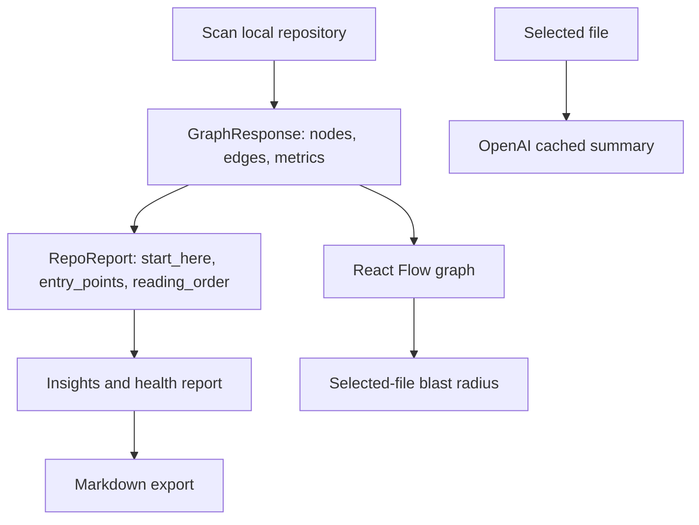

# feat: Add actionable repository intelligence

## Summary

Make the repository visualizer answer the real onboarding question: "Where should I start, and what breaks if I touch this file?" The core stays the same: local FastAPI scan, static dependency graph, React Flow canvas, OpenAI-only file summaries, and local caching.

The work adds a practical analysis layer on top of the existing graph: a ranked repo report, likely entry points, selected-file blast radius, stronger AI summary prompts, and a Markdown export that can be shared without rerunning the app.

## Requirements

- R1. The backend returns an actionable repository report from existing static graph data: ranked findings, likely entry points, and a reading order.
- R2. The frontend shows change impact for a selected file: direct dependents, second-order affected files, and likely affected tests.
- R3. OpenAI summaries explain purpose, important dependencies, change risk, and what to read next; Gemini or extra AI fallbacks stay out.
- R4. The UI surfaces the report in the current insights/sidebar flow without changing the React Flow-centered product.
- R5. Users can export a Markdown repository report without requiring OpenAI.
- R6. Keep scope local-first and simple: no vector database, background worker, auth, persistent database, MCP server, or chat agent.

## Research Inputs

- Reddit users discussing codebase graph tools cared less about pretty graphs and more about where to start, feature flow, and what might break.
- React dependency graph users specifically valued blast radius, indirect dependencies, and logic concentration.
- Code graph discussions on Reddit and X repeatedly framed useful output as relationship-aware context, architectural core detection, duplicate/noisy edge reduction, and refactor-risk reduction.

## Key Decisions

- Extend `/api/analyze` with a lightweight `repo_report` field instead of adding another endpoint.
- Compute report data from `GraphNode`, `GraphEdge`, folder summaries, cycles, and scanned file content.
- Keep blast radius client-side because the full graph is already loaded.
- Export Markdown client-side from the current graph/report state; no server writes or download endpoint.
- Version the OpenAI prompt in the cache key so improved summaries do not keep serving stale old-format cache entries.

## Scope Boundaries

In scope:

- Ranked repo report
- Likely entry point detection
- Reading order
- Selected-file blast radius
- Markdown report export
- OpenAI prompt and cache-version update
- Backend and frontend tests
- README update for the new useful-output workflow

Out of scope:

- Symbol-level call graph
- Runtime tracing
- Vector search or RAG
- Background indexing
- Database persistence
- Git blame/churn analysis
- Multi-agent chat inside the product
- Authentication or hosted SaaS behavior

## Design

## Implementation Units

### U1: Backend repo report model and ranking

Files:

- Modify: `backend/app/models.py`
- Modify: `backend/app/graph.py`
- Modify: `backend/tests/test_graph.py`
- Modify: `backend/tests/test_api.py`

Goal:

- Add `RepoReport`, `ReportFinding`, and `EntryPointSummary` models.
- Add `repo_report` to `GraphResponse`.
- Rank useful findings from existing graph data: cycles, unresolved imports, largest files, highest complexity, and dependency hubs.

Approach:

- Build the report after nodes, edges, folders, and cycles are computed.
- Cap each list so large repositories stay readable.
- Prefer deterministic sorting by severity, metric value, then path.
- Avoid sample-specific rules.

Test Scenarios:

- A repo with a cycle exposes a high-severity report finding.
- A repo with unresolved imports exposes a report finding.
- A repo with large or complex files produces stable ranked findings.
- Small clean repos return an empty or low-noise report without crashing.

Verification:

- `cd backend && .venv/bin/pytest`

### U2: Likely entry point detection

Files:

- Modify: `backend/app/graph.py`
- Modify: `backend/tests/test_graph.py`

Goal:

- Detect likely entry points from scanned source text without executing code.

Approach:

- Python: detect `if __name__ == "__main__"`, `FastAPI(`, `Flask(`, and route decorators.
- JavaScript/TypeScript: detect `createRoot(` and `ReactDOM.render(`.
- C/C++: detect `int main(`.
- Return labels as "likely" to avoid overclaiming.

Test Scenarios:

- FastAPI route files are entry points.
- Python CLI files are entry points.
- React root files are entry points.
- C/C++ `main` files are entry points.
- Utility modules are not entry points.

Verification:

- `cd backend && .venv/bin/pytest backend/tests/test_graph.py`

### U3: Frontend report and blast radius UI

Files:

- Modify: `frontend/src/types/graph.ts`
- Modify: `frontend/src/App.tsx`
- Modify: `frontend/src/components/RepositoryInsights.tsx`
- Modify: `frontend/src/components/NodePanel.tsx`
- Modify: `frontend/src/styles.css`
- Modify: `frontend/tests/repository-insights.test.tsx`
- Modify: `frontend/tests/node-panel.test.tsx`

Goal:

- Render backend report findings as the primary "Start here" guidance.
- Show selected-file change impact in the side panel.

Approach:

- Use `graph.repo_report.start_here` instead of purely client-derived priority guesses.
- Pass the loaded graph into `NodePanel`.
- Compute direct dependents, second-order dependents, and likely tests from graph edges.
- Keep the graph canvas unchanged.

Test Scenarios:

- Report findings render and selecting one focuses its file.
- NodePanel shows direct and second-order impact.
- Likely affected tests are called out when affected paths look like tests.
- Empty impact states render cleanly.

Verification:

- `cd frontend && npm test -- --run`

### U4: Stronger OpenAI summary contract

Files:

- Modify: `backend/app/ai.py`
- Modify: `backend/tests/test_api.py`
- Modify: `backend/tests/test_cache.py`

Goal:

- Make summaries useful for onboarding and refactoring, not just generic explanations.

Approach:

- Prompt OpenAI for four short bullets: purpose, key dependencies, change risk, and next file to read.
- Keep OpenAI as the only provider.
- Add a prompt version to the summary cache key or content hash so old prompt outputs do not mask the new contract.

Test Scenarios:

- OpenAI prompt contains the four expected output sections.
- Cache-only behavior still works when no cached summary exists.
- Existing summary cache behavior remains deterministic.

Verification:

- `cd backend && .venv/bin/pytest backend/tests/test_api.py backend/tests/test_cache.py`

### U5: Markdown export and docs

Files:

- Create: `frontend/src/utils/reportExport.ts`
- Create: `frontend/tests/report-export.test.ts`
- Modify: `frontend/src/components/RepositoryInsights.tsx`
- Modify: `README.md`

Goal:

- Let users export useful analysis output for onboarding notes, PR planning, or demos.

Approach:

- Build Markdown from the current `GraphResponse`.
- Include scan stats, start-here findings, entry points, reading order, folder summaries, cycles, and scan limitations.
- Trigger download from the insights panel with no new dependency.

Test Scenarios:

- Markdown includes repo path, stats, report findings, entry points, and limitations.
- Empty sections are handled without ugly blank output.
- Export button calls the client-side download helper.

Verification:

- `cd frontend && npm test -- --run`

## Verification Plan

- Backend tests: `cd backend && .venv/bin/pytest`
- Frontend tests: `cd frontend && npm test -- --run`
- Frontend build: `cd frontend && npm run build`
- Optional manual check: run backend and frontend, analyze the sample repo, click a node, inspect report and blast radius, export Markdown.

## Risks

- Entry point heuristics can miss frameworks; labels must stay honest as "likely".
- Large repos can produce noisy reports; cap and rank aggressively.
- Changing `GraphResponse` requires backend/frontend type sync.
- Prompt-version cache changes may invalidate old summaries, which is intended for this upgrade.
