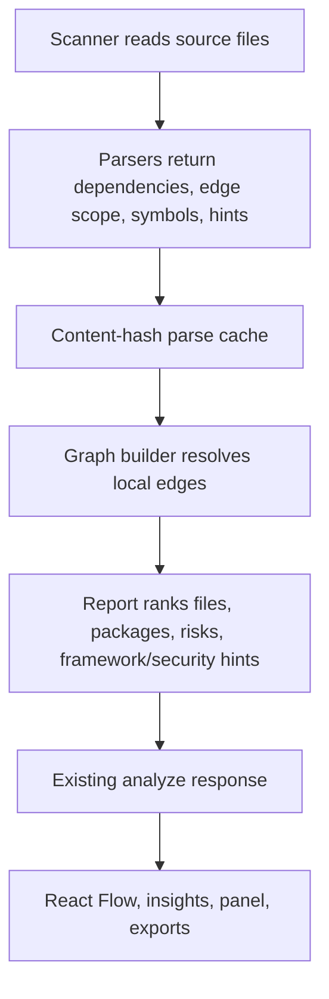

# feat: Improve Repository Intelligence

## Summary

Add practical repo-understanding features that make scans more useful without turning the app into a hosted platform: edge timing, risk scoring, package summaries, symbol hotspots, lightweight security/framework hints, and export formats.

---

## Problem Frame

The current graph is useful, but several README limitations are still true: import edges are not classified deeply enough, large files lack method/class guidance, package-level views are thin, exports are Markdown-only, and framework behavior is mostly invisible. The goal is to fix the parts users feel during onboarding and refactoring while avoiding unrelated platform features.

---

## Requirements

- R1. Classify dependency edges by useful static timing: top-level, lazy/local, conditional, type-checking, re-export, and dynamic.
- R2. Add per-file maintainability and risk signals that combine size, complexity, coupling, unresolved imports, security hints, and test coverage hints.
- R3. Add package-level summaries so users can reason about folders/modules before zooming into file nodes.
- R4. Detect method/class hotspots inside large files for Python and JavaScript/TypeScript.
- R5. Add lightweight framework and security findings where static code makes them visible.
- R6. Cache dependency parsing by file content hash during the backend process.
- R7. Add CSV and JSON exports in addition to Markdown.
- R8. Surface the new outputs in the existing UI and exported reports without adding new backend services or storage.

---

## Key Technical Decisions

- **Extend existing graph models:** Add fields to the current API response instead of creating new endpoints. The frontend already consumes one analysis payload cleanly.
- **Static-first framework hints:** Detect route/settings/signal/app-registry clues from source text and dependency metadata. Do not run target repositories.
- **In-process parse cache:** Cache parsed dependencies by file hash inside the backend process. Persistent analysis storage is deferred until repeated scans prove it is needed.
- **Simple risk score:** Use an explainable weighted score over existing metrics and findings. Avoid opaque maintainability formulas as the primary ranking.
- **Frontend-only CSV/JSON export:** Export the already-fetched graph response from the browser. A backend export endpoint would duplicate state the UI already has.
- **Borrow only useful prior-art ideas:** Keep heatmap/risk, package-level graph thinking, security hints, and richer exports. Defer database ingestion, git ownership, RAG chat, benchmarking, and PDF reports.

---

## High-Level Technical Design

---

## Implementation Units

### U1. Edge Timing And Parse Cache

**Goal:** Dependencies carry static timing/scope labels and parser results are cached by file content hash.

**Requirements:** R1, R6

**Dependencies:** None

**Files:** `backend/app/models.py`, `backend/app/parsers.py`, `backend/app/graph.py`, `backend/tests/test_parsers.py`, `backend/tests/test_graph.py`, `frontend/src/types/graph.ts`

**Approach:** Add an edge scope enum/string and set it during parsing. Python uses AST parent context for top-level, lazy/local function/class imports, type-checking imports, and conditional imports. JavaScript/TypeScript marks static imports, re-exports, dynamic imports, and conditional require/import patterns where detectable. Graph edges carry the scope label and de-duplicate by source, target, kind, and scope.

**Patterns to follow:** Current `Dependency`, `GraphEdge`, and `build_graph` flow.

**Test scenarios:**
- Python top-level import produces a top-level edge.
- Python function-local import produces a lazy/local edge.
- Python `if TYPE_CHECKING` import produces a type-checking edge.
- JavaScript `export ... from` produces a re-export edge.
- Dynamic import keeps `dynamic_import` kind and dynamic scope.
- Repeated parse of identical file text uses cached parser output without changing graph output.

**Verification:** Backend parser and graph tests cover scope labels and cache-safe output.

### U2. Risk Metrics And Package Summaries

**Goal:** Files and folders/packages expose risk and maintainability signals that help users pick what to inspect first.

**Requirements:** R2, R3

**Dependencies:** U1

**Files:** `backend/app/models.py`, `backend/app/scanner.py`, `backend/app/graph.py`, `backend/tests/test_scanner.py`, `backend/tests/test_graph.py`, `frontend/src/types/graph.ts`

**Approach:** Add file-level maintainability and risk score fields. Build package summaries from top-level folders with files, LoC, average complexity, average risk, dependency count, dependent count, and highest-risk files. Feed those summaries into the existing report and UI.

**Patterns to follow:** Current `FileMetrics` and `FolderSummary` aggregation.

**Test scenarios:**
- High LoC plus high complexity produces higher risk than a small simple file.
- Unresolved imports and high dependents increase risk score.
- Package summaries aggregate file counts, LoC, risk, dependencies, and top risky files.
- Existing folder summary behavior remains stable for simple repos.

**Verification:** Backend tests prove scores are deterministic and package summaries are returned in the analyze response.

### U3. Symbol Hotspots, Security Hints, And Framework Hints

**Goal:** Large files show method/class hotspots, and the report calls out static security/framework clues worth inspecting.

**Requirements:** R4, R5

**Dependencies:** U2

**Files:** `backend/app/models.py`, `backend/app/parsers.py`, `backend/app/scanner.py`, `backend/app/graph.py`, `backend/tests/test_parsers.py`, `backend/tests/test_graph.py`, `frontend/src/types/graph.ts`, `frontend/src/components/NodePanel.tsx`, `frontend/src/components/RepositoryInsights.tsx`

**Approach:** Parse Python classes/functions with line numbers and simple symbol complexity. Parse JavaScript/TypeScript function/class exports with regex heuristics. Add low-noise security hints for hardcoded secrets, private keys, `eval`, shell execution, and unsafe React HTML. Add framework hints for Python routes, Flask/FastAPI apps, Django settings/URLs, React roots, package scripts, and CI/Docker files.

**Patterns to follow:** Current entry-point detection and report finding generation.

**Test scenarios:**
- Python functions/classes appear as symbols with line numbers.
- A complex function appears before a simple function in selected-file hotspots.
- A fake secret placeholder is ignored, while a realistic hardcoded secret is flagged.
- FastAPI/Flask/Django/React clues produce framework hints without executing code.
- Node panel displays symbols and hints for the selected file.

**Verification:** Backend tests cover parser output and report findings; frontend tests cover rendered hotspots/hints.

### U4. CSV And JSON Exports

**Goal:** Users can export machine-readable and spreadsheet-friendly reports from the existing analysis result.

**Requirements:** R7

**Dependencies:** U2, U3

**Files:** `frontend/src/utils/reportExport.ts`, `frontend/src/components/RepositoryInsights.tsx`, `frontend/tests/report-export.test.ts`

**Approach:** Keep Markdown export and add CSV/JSON download helpers. CSV lists files with metrics, risk, dependencies, dependents, package, and hints. JSON exports the full graph response pretty-printed.

**Patterns to follow:** Existing `downloadMarkdownReport` helper.

**Test scenarios:**
- CSV export includes a header row and escapes comma/quote/newline values.
- JSON export contains graph stats, nodes, edges, report, package summaries, and hints.
- Markdown report includes the new risk/package/security/symbol sections.

**Verification:** Frontend utility tests assert export contents without needing browser downloads.

### U5. UI And README Polish

**Goal:** The new signals are visible where users already look: graph nodes, insights, selected-file panel, and docs.

**Requirements:** R2, R3, R4, R5, R8

**Dependencies:** U1, U2, U3, U4

**Files:** `frontend/src/graph/GraphCanvas.tsx`, `frontend/src/components/RepositoryInsights.tsx`, `frontend/src/components/NodePanel.tsx`, `frontend/src/styles.css`, `frontend/tests/graph-view.test.tsx`, `frontend/tests/node-panel.test.tsx`, `frontend/tests/repository-insights.test.tsx`, `README.md`

**Approach:** Add risk tone to nodes, package summary list, symbol hotspot section, framework/security hint sections, edge-scope labels in graph edges, and export buttons. Update README limitations to remove fixed items and keep only honest remaining gaps.

**Patterns to follow:** Existing compact insight sections, node panel sections, and graph toolbar controls.

**Test scenarios:**
- Graph nodes display risk alongside LoC, complexity, and dependency count.
- Insights panel shows top packages and supports CSV/JSON export controls.
- Node panel shows symbol hotspots and security/framework hints for a selected node.
- README no longer claims fixed limitations remain.

**Verification:** Frontend tests and TypeScript build pass; README reflects shipped behavior.

---

## Scope Boundaries

- No database, Redis, Elasticsearch, ZIP upload, remote cloning, multi-repo benchmarking, PDF reports, git ownership analytics, or RAG chat.
- No runtime framework execution. Framework layers are static hints only.
- No public comparison section in README.

---

## Risks And Dependencies

- Static edge timing is heuristic. The UI and reports should label it as static scope, not runtime truth.
- Security hints must stay low-noise. False positives make the tool feel cheap.
- JSON response growth should stay acceptable for 1000-file scans; symbols should be capped per file.

---

## Documentation Notes

Update README features, known limitations, and useful next features after implementation. Keep prior-art notes out of the README unless they describe this project’s own behavior.
